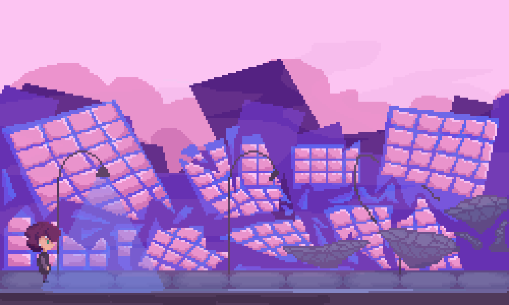

# Lucyd Dreams

## Tipo do Projeto
Um jogo plataformer com mecânicas de parkour e powerups.

## Descrição do Projeto 
Um jogo que se passa nos sonhos de Lucy (personagem principal), que ao descobrir que não há como escapar deles encontra uma forma de utilizar eles para atingir seus objetivos. Tendo então Sonhos Lúcidos. 

## Telas

Primeira concept art da rua no mundo dos sonhos. Construções em ruínas e pedaços da rua flutuando. 
